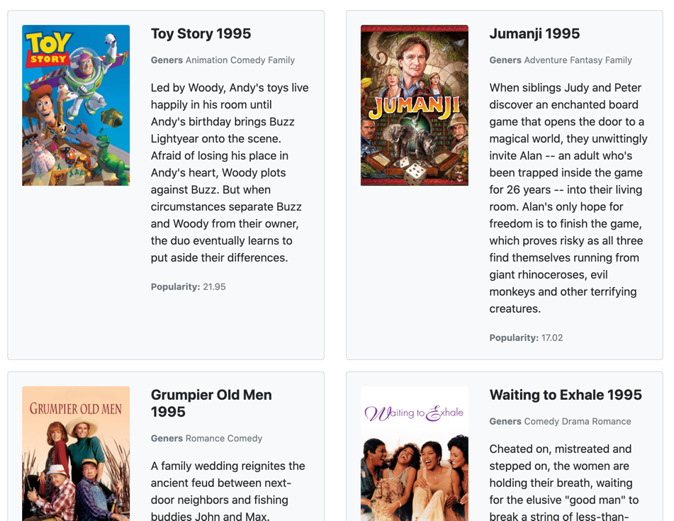

# CardsList v1

Необхідно реалізувати "CardsList v1" компонент, 
який буде відповідати за відображення списку карток товарів.  

На вхід компонент має приймати масив данних та компонент, який буде 
відповідати за відображення карток фільмів.

```js
const component = new CardsList({
  data: movies.map(processData),
  CardComponent: MovieCard
});
```



**Note:** Перед початком імплементації слід зазирнути в файл тестів.

## Корисні посилання:

* [replaceChildren](https://developer.mozilla.org/en-US/docs/Web/API/Element/replaceChildren)
* [DocumentFragment](https://developer.mozilla.org/en-US/docs/Web/API/DocumentFragment)

