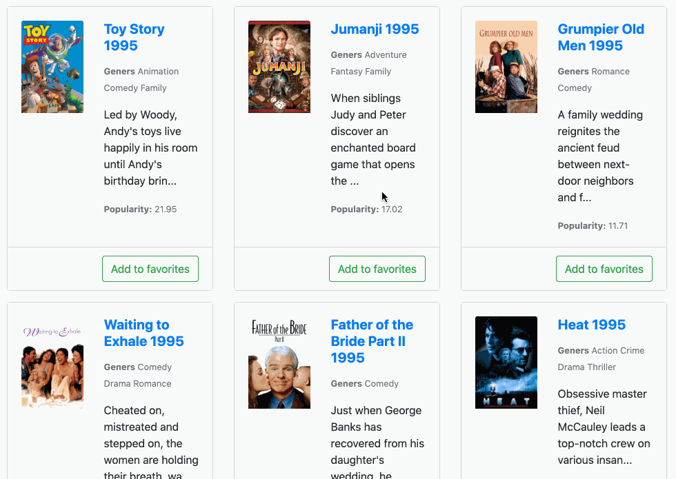

# CardsList v2

Необхідно реалізувати "CardsList v2" компонент розширивши функціонал компоненту "CardsList v1".

Данні для компонента - список фільмів, слід завантажити з api: 
[http://demo.bootcamp.place/api/movies?start=0&end=20](http://demo.bootcamp.place/api/movies?start=0&end=20)

Для трансформації даних, отриманих з сервера, слід використати функцію `processData` з директорії
"utils".

**Note:** Перед початком імплементації слід зазирнути в файл тестів.

## Корисні посилання:

* [async/await](https://javascript.info/async-await)
* [promise-basics](https://javascript.info/promise-basics)
