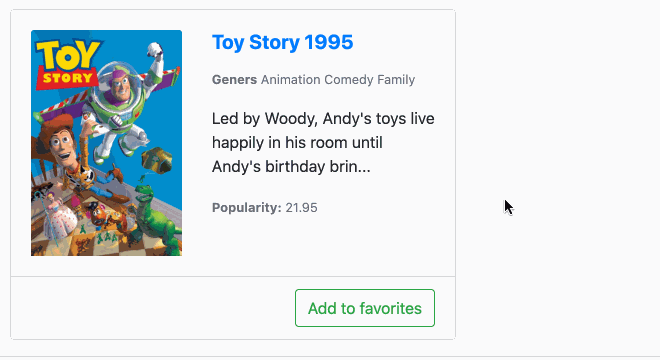

# MovieCard v2

Необхідно реалізувати "MovieCard v2" компонент розширивши функціонал компоненту "MovieCard v1".

Необхідно задати параметр `showFullInfo`, якщо даний параметр знаходиться в значенні `true` -
показувати повний текст `overview`, якщо знаходиться в значенні `false` - показати
текст `overviewStart`.

Додатково реалізувати показ футеру картки в якому буде знаходитись кнопка додавання та видалення
фільму з колекції улюблених фільмів.

**Note:** Перед початком імплементації слід зазирнути в файл тестів.
